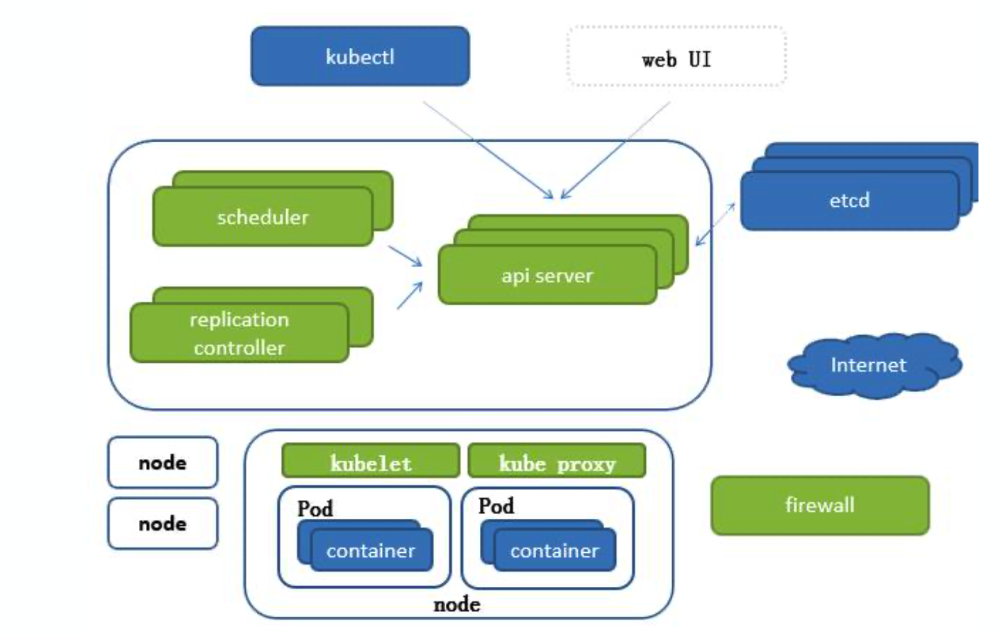
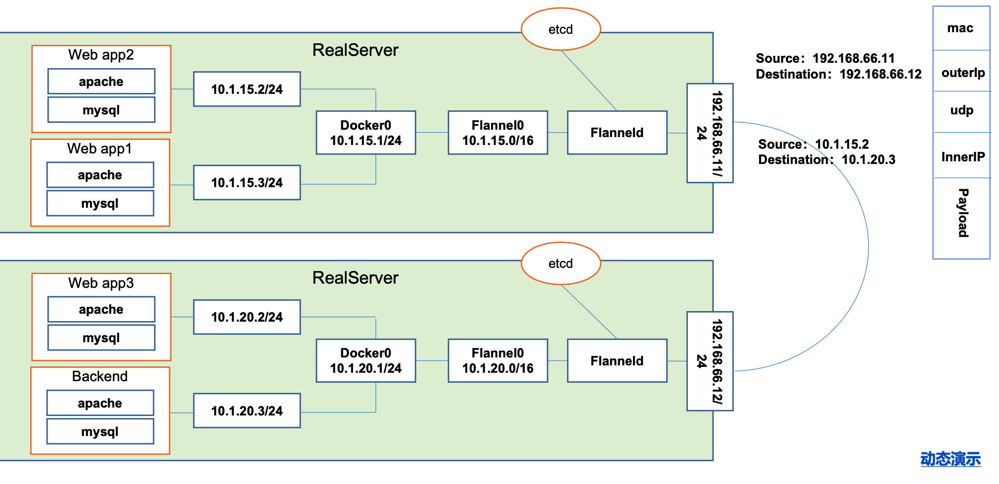
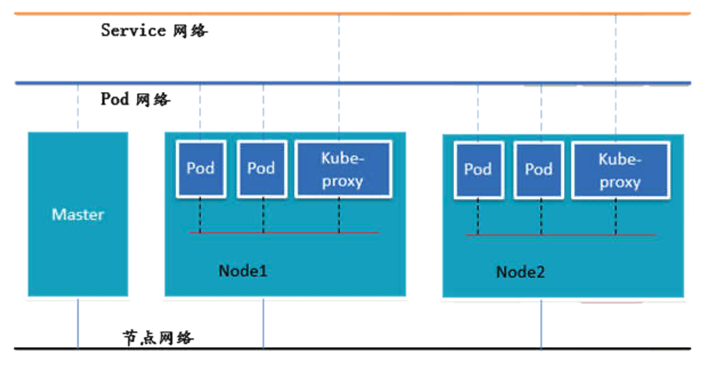

# Docker 

## 1. Intro
#### Tools
- Docker: required Windows Hyper-V
- Command: Powershell, Terminal
- Editor: Visual Studio Code
- Docker version baseon YY.MM
- Docker commmand
    command format: <command> <subcommand> <option>
    e.g. version, info
#### Image && Container
- Image: appliation to run
- Container: instance of image, many containers running for same image
#### Docker Container
- Command
    - docker run <image>
    - docker container ls: list container running
    - docker container ls -a: list container ran and running
    - docker container start/stop <container id>
    - docker container rm
    - Options
        -d: detach
        -e: env
        -name: name
- Details
    - lookup local image
    - lookup remote image in repository and download latest version
    - create container from image
    - give virutal IP of private network
    - startup container
#### Container vs VM
- container: clusters of process running in os
- vm: virtualized hardware/os/process
***


## 2. Docker Container
#### Run
- docker run <option> <image> <command>
    + --publish <localport>:<imageport>
    + --e <environment variable>: mysql password uos9xooPhia4iem2airohngeing3ahta
- docker container stop <container_id>
- docker container rm
- Options
    -d: detach
    -e: env
    --name: name
- E.g 
    + docker container run -p 80:80 -d --name webhost nginx
    + docker container run -p 8080:80 -d --name apache httpd
#### Container-list    
- docker container ls: list container running
- docker container ls -a: list container ran and running
#### Monitor
- container top <container_id>: process in single container
- container stat <container_id>: cpu/memory for all container
- container inspect <container_id>: container config
- container logs <container_id>: log 
#### Run shell inside container
- run -it <container> <bash>: start container and run 
    + i: Interactive
    + t: Allocate a pseudo-TTY
    + exit will shutdown container
- start -ai <container> <bash>
    + a: Attached
    + exit does not shutdown container
- exec it <container> <bash>
#### Network
- concept
    + each container connected to private virtual network
    + each virtual network -> host via NAT
    + set container required communication in same sub network
#### Command
- command
    + container -p <host_port>:<container_port>
    + network ls
        - bridge: network container attached, bridge to host
        - host: skip virtual network directly connect to host
        - none
    + network create <network>
    + network inspect <network>
    + network connect/disconnect <network> <container_id>
- dns
    + network create <network>
    + container run --network <network> <container>
        - run the container in same network
        - ping by container name
    + docker container exec -it <container> ping <command> 
        - --net-alias: create network alias to container 
***


## 3. Docker Image
#### What is Image
- App binaries and dependencies
- No kernel, no driver
- Different from virtual machine
#### Docker Hub
- Like Github to store offical/public docker image
- Form by layers
    +Env/Apt/Ubuntu
- Top layer is copy-and-write
- Other layers are read-only
- Update the image is adding one more layer
- Every layer in local cache is unique
- command
    + docker history <image>
    + docker image inspect <image>
- image info
    Repository: [orgnization/person]/<image>
    Tag: label of image commit, 2 different tag can point to same image
- push image
    + docker login
    + docker image tag <username>/<image>:<tag>
    + docker image push <username>/<image>:<tag>
    + E.g 
        docker image tag nginx jiangyufeng/nginx
        docker image push jiangyufeng/nginx:latest
- Dockerfile
    + From:<image><tag>
    + Env: set evniroment key and value
    + Run: shell script
    + Expose: expose port to outside
    + WORKDIR: change the directory
    + CMD: lunch the docker container
    + docker image build -t <image_name>
```
FROM alpine
COPY ./docker-entrypoint.sh /
ENTRYPOINT ["/docker-entrypoint.sh"]
CMD ["ping", "8.8.8.8"]
```
***

## 4. Persistent Data
#### Image is immutable
- only deploy, never change
- persist data
    + volumes: special location outside container
        + find the volume in Dockfile 
        + inspect <container> to findout source and destination mount
        + docker container run -d --name mydb -e MYSQL_ALLOW_EMPTY_PASSWORD=True -v <volume_name>:/var/lib/mysql mysql
    + Bind Mounts: link container path to host path
        + docker container run -d --name mydb -e MYSQL_ALLOW_EMPTY_PASSWORD=True -v <path>:/var/lib/mysql mysql
- delete container will not delete the volume
***


## 5. Compose
#### Feature
- manage the relationship between container
- docker-compose.yml
- create container, networks, volumes
#### Outline
- reference: https://docs.docker.com/compose/compose-file
```
version: '3.1'  # if no version is specificed then v1 is assumed. Recommend v2 minimum

services:  # containers. same as docker run
  servicename: # a friendly name. this is also DNS name inside network
    build:
      context: .
      dockerfile: nginx.Dockerfile
    image: # Optional if you use build:
    command: # Optional, replace the default CMD specified by the image
    environment: # Optional, same as -e in docker run
    volumes: # Optional, same as -v in docker run
  servicename2:

volumes: # Optional, same as docker volume create

networks: # Optional, same as docker network create
```
#### Composite 
- composite multiple docker-compose yml file
- base file: docker-compose.yml
- ext file
    + default: docker-compose.override.yml
    + custom: -f docker-compose.<ext>.yml
#### Command
- docker-compose up|down
- docker-compose build
***


## 6. Swarm
#### Feature
- server clustering
- built-in orchestration
#### Architecture
- Manager node (TLS, Certificate Authority) -> Worker (TLS)
    + API
    + Orchestrator
    + Allocator
    + Scheduler
    + Dispatcher
- Manager node can be Worker node, schedule the task to worker node
    + Worker
    + Executor
#### Routing Mesh
- use IPVS from linux Kernel
- load balances swarm service across all service node
- incoming traffic to published ports
- service communicate each other with by service name
#### Stack
- start up service vim stack.yml
- docker stack deploy -c <stack_file> <app_name>
#### Service Update
- limit the down time
- create/remove via -add or -rm
- change the configuration of service
- docker service update --help to check the docker update options
#### command
- docker swarm init --advertise-addr <ip_address>
- docker swarm join-token [worker|manager]
- docker node ls
- docker node update --role [worker|manager] [host|ip_address]
- docker service create apline ping 8.8.8.8
- docker service ps <service_id>
- docker service update <service_id> --replicas <number_of_instance>
- docker network create --driver overlay <network_name>
- docker stack deploy -c <stack_file> <app_name>
- docker service update --image nginx:1.13.6 web
- docker service update --publish-rm 8088 --publish-add 9090:80 web 
- docker service update --force web
***


## 7. Secrets Storage
#### Feature
- encrypted on disk
- store in manager node
- store in swarm and assigned to service
#### Stack screte
- file: file location
- external: docker secret created
#### Create secrete
- echo "<pw>" | docker secret create psql-pw
- docker secrete create <secrete_name> <file_name> 
```
services:
  psql:
    image: postgres
    secrets:
      - psql_user
      - psql_password
    environment:
      POSTGRES_PASSWORD_FILE: /run/secrets/psql_password
      POSTGRES_USER_FILE: /run/secrets/psql_user

secrets:
  psql_user:
    file: ./psql_user.txt
  psql_password:
    file: ./psql_password.txt
  psql_pass
    external:true
```
#### Command
- docker secret create <secret> <file>
- echo "input_string" | docker secret create <secret> -
- docker service create --name psql --secret psql_user --secret psql_pass -e POSTGRES_PASSWORD_FILE=/run/secrets/psql_pass -e POSTGRES_USER_FILE=/run/secrets/psql_user postgres
***


## 8. Docker Healthcheck
#### Feature
- exec command in container
- state: starting, healthy, unhealthy
- exit 0 (OK) or exit 1 (Error)
- service will replace tasks if they fail healthcheck
- docker stay 30s (default) to ensure docker service in healthy state
#### Options
- --health-cmd: command to check
- --interval: how often
- --timeout: how long timeout
- --reties=N 
### Command
- docker container run --name p2 -d --health-cmd="pg_isready -U postgres || exit 1" postgres
***


## 9. Container Register
#### Docker Hub
- public image registry
- Bitbucket integration
#### Docker store
- docker editions
- docker certificated plugin, container
#### Docker cloud
- auto image building, testing, deployment
- more advance than docker store
***

#K8S
#### K8S vs MESOS vs SWARM
- Apache Mesos: twiter before 2009
- Docker Swarm: light weight 
- Borg: internel used by Google
- K8S
    + developed by Go from Google
    + open source
    + elastic scaling
    + load balancing from IPVS


- etcd: key-value, distributed storage, native support cluster
    + wal: operation log
    + raft: incremental backup
    + snapshot: storage backup
- kubelet: manage container lifecycle
- kube-proxy: mange contianer IPTABLES, IPVS
#### Prod
- Pod Controller
    + ReplicationController: auto scaling pod
    + ReplicasSet: same as RC and support selector
    + Deployment: manage RS to support rolling-update
    + Horizontal Pod Autoscaling: auto scaling based on CPU
    + StatefulSet: service with data persist and network Id
    + DaemonSet: run a pod in every node, e.g. logstash, promethenus
    + CronJob: one time schedule and periodically
- category
    - self pod
    - managed pod
- Pod
    + containers in same Pod: localhost
    + Pod to Service: IPTABLES
    + Pod to Pod
        + container in different node with unique id
        + each node run flanneld daemon process
        + Pods in same node: localhost bridge
        + Pods in different node
            + ETCD store flannel IP segment
            + routing to flannel segment, then routing to pod


            
        


