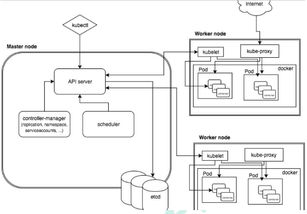

## Kubernate


## 1. 概述

### 总览

Kubernetes 是 Google 开源的一个容器编排引擎，它支持自动化部署、大规模可伸缩、 应用容器化管理

Kubernate提供容器化应用部署，规划，更新，维护的一种 机制。

Kubernate利于扩展，且简单并且高效


### 功能

#### 自动装箱

基于容器对应用运行环境的资源配置要求自动部署应用容器

#### 自我修复

+ 当容器失败时，会对容器进行重启, 
+ 当所部署的 Node 节点有问题时，会对容器进行重新部署和重新调度
+ 当容器未通过监控检查时，会关闭此容器直到容器正常运行时，才会对外提供服务

#### 水平扩展

通过简单的命令、用户 UI 界面或基于 CPU 等资源使用情况，对应用容器进行规模扩大 或规模剪裁

#### 服务发现

用户不需使用额外的服务发现机制，就能够基于 Kubernetes 自身能力实现服务发现和 负载均衡

#### 滚动更新

可以根据应用的变化，对应用容器运行的应用，进行一次性或批量式更新

#### 版本回退 

可以根据应用部署情况，对应用容器运行的应用，进行历史版本即时回退

#### 密钥和配置管理 

在不需要重新构建镜像的情况下，可以部署和更新密钥和应用配置，类似热部署。

#### 存储编排 

自动实现存储系统挂载及应用，特别对有状态应用实现数据持久化非常重要

存储系统可以来自于本地目录、网络存储(NFS、Gluster、Ceph 等)、公共云存储服务 (8)批处理

提供一次性任务，定时任务;满足批量数据处理和分析的场景


### 架构



#### Master Node

k8s 集群控制节点，对集群进行调度管理，接受集群外用户去集群操作请求;

Master Node 由 API Server、Scheduler、ClusterState Store(ETCD 数据库)和 Controller MangerServer 所组成

##### API Server

集群管理统一入口，数据由etcd存储

##### Scheduler

节点调度，比如应用1在node2里面启动

##### Controller-manager

资源控制

##### Etcd

集群信息数据存储


#### Worker Node

集群工作节点，运行用户业务应用容器; Worker Node 包含 kubelet、kube proxy 和 ContainerRuntime;

##### kubelet

master在work node中的代理，管理node节点的状态

##### kube-proxy

网络代理


### 核心概念

#### Pod

最小编排单元， 一组容器的集合， 一个pod共享网络

生命周期的是短暂的


#### Controller

预期pod的副本数量

可以部署无状态应用部署和有状态应用部署

可以执行一次性任务和定时任务


#### Service

定义一组pod的访问规则


## 2. 安装

单master节点：一个master， 多个node

master集群：多个master，多个node，master和node中间有负载均衡


## 3. Environment
- master: 192.168.66.10
- node1/node2: 192.168.66.20/21
- koolshare: 192.168.66.240, koolshare/koolshare
- os update
```shell script
#设置系统主机名以及 Host 文件的相互解析
hostnamectl  set-hostname  k8s-master01

#安装依赖包
yum install -y conntrack ntpdate ntp ipvsadm ipset jq iptables curl sysstat libseccomp wgetvimnet-tools git

#设置防火墙为 Iptables 并设置空规则
systemctl  stop firewalld  &&  systemctl  disable firewalld
yum -y install iptables-services  &&  systemctl  start iptables  &&  systemctl  enable iptables&&  iptables -F  &&  service iptables save

#关闭 SELINUX
swapoff -a && sed -i '/ swap / s/^\(.*\)$/#\1/g' /etc/fstab
setenforce 0 && sed -i 's/^SELINUX=.*/SELINUX=disabled/' /etc/selinux/config

调整内核参数，对于 K8S
cat > kubernetes.conf <<EOF
net.bridge.bridge-nf-call-iptables=1
net.bridge.bridge-nf-call-ip6tables=1
net.ipv4.ip_forward=1
net.ipv4.tcp_tw_recycle=0
vm.swappiness=0 # 禁止使用 swap 空间，只有当系统 OOM 时才允许使用它
vm.overcommit_memory=1 # 不检查物理内存是否够用
vm.panic_on_oom=0 # 开启 OOM
fs.inotify.max_user_instances=8192
fs.inotify.max_user_watches=1048576
fs.file-max=52706963
fs.nr_open=52706963
net.ipv6.conf.all.disable_ipv6=1
net.netfilter.nf_conntrack_max=2310720
EOF
cp kubernetes.conf  /etc/sysctl.d/kubernetes.conf
sysctl -p /etc/sysctl.d/kubernetes.conf


#调整系统时区
# 设置系统时区为中国/上海
timedatectl set-timezone Asia/Shanghai
# 将当前的 UTC 时间写入硬件时钟
timedatectl set-local-rtc 0
# 重启依赖于系统时间的服务
systemctl restart rsyslog
systemctl restart crond

#关闭系统不需要服务
systemctl stop postfix && systemctl disable postfix

#设置 rsyslogd 和 systemd journald
mkdir /var/log/journal # 持久化保存日志的目录
mkdir /etc/systemd/journald.conf.d
cat > /etc/systemd/journald.conf.d/99-prophet.conf <<EOF

[Journal]
# 持久化保存到磁盘
Storage=persistent

# 压缩历史日志
Compress=yes

SyncIntervalSec=5m
RateLimitInterval=30s
RateLimitBurst=1000

# 最大占用空间 10G
SystemMaxUse=10G

# 单日志文件最大 200M
SystemMaxFileSize=200M

# 日志保存时间 2 周
MaxRetentionSec=2week

# 不将日志转发到 
syslogForwardToSyslog=no
EOF

systemctl restart systemd-journald


#升级系统内核为 4.44
rpm -Uvh http://www.elrepo.org/elrepo-release-7.0-3.el7.elrepo.noarch.rpm
# 安装完成后检查 /boot/grub2/grub.cfg 中对应内核 menuentry 中是否包含 initrd16 配置，如果没有，再安装一次！
yum --enablerepo=elrepo-kernel install -y kernel-lt
# 设置开机从新内核启动
grub2-set-default "CentOS Linux (4.4.182-1.el7.elrepo.x86_64) 7 (Core)" & reboot
# 重启后安装内核源文件
yum --enablerepo=elrepo-kernel install kernel-lt-devel-$(uname -r) kernel-lt-headers-$(uname -r)

#关闭 NUMA
cp /etc/default/grub{,.bak}
vim /etc/default/grub # 在 GRUB_CMDLINE_LINUX 一行添加 `numa=off` 参数，如下所示：
diff /etc/default/grub.bak /etc/default/grub
6c6
< GRUB_CMDLINE_LINUX="crashkernel=auto rd.lvm.lv=centos/root rhgb quiet"
---
> GRUB_CMDLINE_LINUX="crashkernel=auto rd.lvm.lv=centos/root rhgb quiet numa=off"
cp /boot/grub2/grub.cfg{,.bak}
grub2-mkconfig -o /boot/grub2/grub.cfg
```
- k8s installation
```shell script

#kube-proxy开启ipvs的前置条件
modprobe br_netfilter

cat > /etc/sysconfig/modules/ipvs.modules <<EOF
#!/bin/bash
modprobe -- ip_vs
modprobe -- ip_vs_rr
modprobe -- ip_vs_wrr
modprobe -- ip_vs_sh
modprobe -- nf_conntrack_ipv4
EOF

chmod 755 /etc/sysconfig/modules/ipvs.modules && bash /etc/sysconfig/modules/ipvs.modules && lsmod | grep -e ip_vs -e nf_conntrack_ipv4

#安装 Docker 软件
yum install -y yum-utils device-mapper-persistent-data lvm2
yum-config-manager --add-repo  http://mirrors.aliyun.com/docker-ce/linux/centos/docker-ce.repo
yum update -y && yum install -y docker-ce

## 创建 /etc/docker 目录
mkdir /etc/docker

# 配置 daemon.
cat > /etc/docker/daemon.json <<EOF
{
  "exec-opts": ["native.cgroupdriver=systemd"],
  "log-driver": "json-file",
  "log-opts": {
    "max-size": "100m"  
  }
}
EOF

mkdir -p /etc/systemd/system/docker.service.d

# 重启docker服务
systemctl daemon-reload && systemctl restart docker && systemctl enable docker


#安装 Kubeadm （主从配置）
cat <<EOF > /etc/yum.repos.d/kubernetes.repo
[kubernetes]
name=Kubernetes
baseurl=http://mirrors.aliyun.com/kubernetes/yum/repos/kubernetes-el7-x86_64
enabled=1
gpgcheck=0
repo_gpgcheck=0
gpgkey=http://mirrors.aliyun.com/kubernetes/yum/doc/yum-key.gpg
http://mirrors.aliyun.com/kubernetes/yum/doc/rpm-package-key.gpg
EOF

yum -y  install  kubeadm-1.15.1 kubectl-1.15.1 kubelet-1.15.1
systemctl enable kubelet.service

#初始化主节点
kubeadm config print init-defaults > kubeadm-config.yaml

# 安装flannel
kubectl create -f kube-flannel.yml
```
- kubeadmin-config.yaml
```yaml
apiVersion: kubeadm.k8s.io/v1beta2
bootstrapTokens:
- groups:
  - system:bootstrappers:kubeadm:default-node-token
  token: abcdef.0123456789abcdef
  ttl: 24h0m0s
  usages:
  - signing
  - authentication
kind: InitConfiguration
localAPIEndpoint:
  advertiseAddress: 192.168.66.10
  bindPort: 6443
nodeRegistration:
  criSocket: /var/run/dockershim.sock
  name: k8s-master01
  taints:
  - effect: NoSchedule
    key: node-role.kubernetes.io/master
---
apiServer:
  timeoutForControlPlane: 4m0s
apiVersion: kubeadm.k8s.io/v1beta2
certificatesDir: /etc/kubernetes/pki
clusterName: kubernetes
controllerManager: {}
dns:
  type: CoreDNS
etcd:
  local:
    dataDir: /var/lib/etcd
imageRepository: k8s.gcr.io
kind: ClusterConfiguration
kubernetesVersion: v1.15.1
networking:
  dnsDomain: cluster.local
  podSubnet: 10.244.0.0/16
  serviceSubnet: 10.96.0.0/12
scheduler: {}
---
apiVersion: kubeproxy.config.k8s.io/v1alpha1
kind: KubeProxyConfiguration
featureGates:
   SupportIPVSProxyMode: true
mode: ipvs
```
***

## 4. Resource
#### Cluster Resource Category
+ namespace: only visible specific node, pod
    + Workload: Pod, ReplicaSet, Deployment, StatefulSet, DaemonSet, Job, CronJob
    + ServiceDiscovery LoadBalance: Service, Ingress
    + Storage: Volume, CSI(container storage interface) to interact with 3rd party
    + Special: ConfigMap, Secret, DownwardAPI(transfer outer resource into container)
+ cluster
    + Namesapce, Node, Role
+ metadata
    + HPA, PodTemplate, LimitRange
#### Resource List
- Yaml
    + Yaml: data-oriented
    + forbidden tab
- Pod


