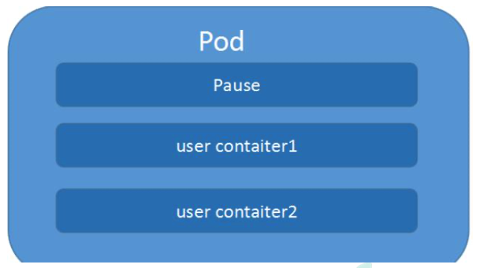

## Kubernate


## 1. 概述

### 1.1 总览

Kubernetes 是 Google 开源的一个容器编排引擎，它支持自动化部署、大规模可伸缩、 应用容器化管理

Kubernate提供容器化应用部署，规划，更新，维护的一种 机制。

Kubernate利于扩展，且简单并且高效


### 1.2 功能

#### 自动装箱

基于容器对应用运行环境的资源配置要求自动部署应用容器

#### 自我修复

+ 当容器失败时，会对容器进行重启, 
+ 当所部署的 Node 节点有问题时，会对容器进行重新部署和重新调度
+ 当容器未通过监控检查时，会关闭此容器直到容器正常运行时，才会对外提供服务

#### 水平扩展

通过简单的命令、用户 UI 界面或基于 CPU 等资源使用情况，对应用容器进行规模扩大 或规模剪裁

#### 服务发现

用户不需使用额外的服务发现机制，就能够基于 Kubernetes 自身能力实现服务发现和 负载均衡

#### 滚动更新

可以根据应用的变化，对应用容器运行的应用，进行一次性或批量式更新

#### 版本回退 

可以根据应用部署情况，对应用容器运行的应用，进行历史版本即时回退

#### 密钥和配置管理 

在不需要重新构建镜像的情况下，可以部署和更新密钥和应用配置，类似热部署。

#### 存储编排 

自动实现存储系统挂载及应用，特别对有状态应用实现数据持久化非常重要

存储系统可以来自于本地目录、网络存储(NFS、Gluster、Ceph 等)、公共云存储服务 (8)批处理

提供一次性任务，定时任务;满足批量数据处理和分析的场景


### 1.3 架构


#### Master Node

k8s 集群控制节点，对集群进行调度管理，接受集群外用户去集群操作请求;

Master Node 由 API Server、Scheduler、ClusterState Store(ETCD 数据库)和 Controller MangerServer 所组成

##### API Server

集群管理统一入口，数据由etcd存储

##### Scheduler

节点调度，比如应用1在node2里面启动

##### Controller-manager

资源控制

##### Etcd

集群信息数据存储


#### Worker Node

集群工作节点，运行用户业务应用容器; Worker Node 包含 kubelet、kube proxy 和 ContainerRuntime;

##### kubelet

master在work node中的代理，管理node节点的状态

##### kube-proxy

网络代理


### 1.4 核心概念

#### Pod

最小编排单元， 一组容器的集合， 一个pod共享网络

生命周期的是短暂的


#### Controller

预期pod的副本数量

可以部署无状态应用部署和有状态应用部署

可以执行一次性任务和定时任务


#### Service

定义一组pod的访问规则


## 2. 安装

单master节点：一个master， 多个node

master集群：多个master，多个node，master和node中间有负载均衡

[kubeadm安装](./使用kubeadm快速部署一个K8s集群.md)

[二进制安装](./使用kubeadm搭建高可用的K8s集群.md)


## 3. Kubectl

### 3.1 概述

kubectl 是 Kubernetes 集群的命令行工具，通过 kubectl 能够对集群本身进行管理，并能 够在集群上进行容器化应用的安装部署。


### 3.2 语法

```shell
kubectl [command] [type] [name] [flag]
```

+ comand:指定要对资源执行的操作，例如 create、get、describe 和 delete
+ TYPE:指定资源类型，资源类型是大小写敏感的，开发者能够以单数、复数和缩略的 形式。例如:
+ NAME:指定资源的名称，名称也大小写敏感的。如果省略名称，则会显示所有的资源， 例如
+ flags:指定可选的参数。例如，可用-s 或者–server 参数指定 Kubernetes API server 的地址和端口。

```shell
[root@k8s-master ~]# kubectl get nodes
NAME         STATUS   ROLES    AGE   VERSION
k8s-master   Ready    master   78d   v1.18.5
k8s-node1    Ready    <none>   78d   v1.18.5
k8s-node2    Ready    <none>   78d   v1.18.5
[root@k8s-master ~]# kubectl get node k8s-node1
NAME        STATUS   ROLES    AGE   VERSION
k8s-node1   Ready    <none>   78d   v1.18.5
[root@k8s-master ~]# kubectl get pods
NAME                    READY   STATUS             RESTARTS   AGE
nginx-f89759699-qdp94   1/1     Running            1          22d
test-liveness-exec      0/1     CrashLoopBackOff   80         73d
[root@k8s-master ~]# kubectl get pod nginx-f89759699-qdp94
NAME                    READY   STATUS    RESTARTS   AGE
nginx-f89759699-qdp94   1/1     Running   1          22d
[root@k8s-master ~]# kubectl --help
kubectl controls the Kubernetes cluster manager.

 Find more information at: https://kubernetes.io/docs/reference/kubectl/overview/

Basic Commands (Beginner):
  create        Create a resource from a file or from stdin.
  expose        Take a replication controller, service, deployment or pod and expose it as a new Kubernetes Service
  run           Run a particular image on the cluster
  set           Set specific features on objects

Basic Commands (Intermediate):
  explain       Documentation of resources
  get           Display one or many resources
  edit          Edit a resource on the server
  delete        Delete resources by filenames, stdin, resources and names, or by resources and label selector

Deploy Commands:
  rollout       Manage the rollout of a resource
  scale         Set a new size for a Deployment, ReplicaSet or Replication Controller
  autoscale     Auto-scale a Deployment, ReplicaSet, or ReplicationController

Cluster Management Commands:
  certificate   Modify certificate resources.
  cluster-info  Display cluster info
  top           Display Resource (CPU/Memory/Storage) usage.
  cordon        Mark node as unschedulable
  uncordon      Mark node as schedulable
  drain         Drain node in preparation for maintenance
  taint         Update the taints on one or more nodes

Troubleshooting and Debugging Commands:
  describe      Show details of a specific resource or group of resources
  logs          Print the logs for a container in a pod
  attach        Attach to a running container
  exec          Execute a command in a container
  port-forward  Forward one or more local ports to a pod
  proxy         Run a proxy to the Kubernetes API server
  cp            Copy files and directories to and from containers.
  auth          Inspect authorization

Advanced Commands:
  diff          Diff live version against would-be applied version
  apply         Apply a configuration to a resource by filename or stdin
  patch         Update field(s) of a resource using strategic merge patch
  replace       Replace a resource by filename or stdin
  wait          Experimental: Wait for a specific condition on one or many resources.
  convert       Convert config files between different API versions
  kustomize     Build a kustomization target from a directory or a remote url.

Settings Commands:
  label         Update the labels on a resource
  annotate      Update the annotations on a resource
  completion    Output shell completion code for the specified shell (bash or zsh)
```


## 4. 资源清单

k8s 集群中对资源管理和资源对象编排部署都可以通过声明样式(YAML)文件来把需要对资源对象操作编辑到 YAML 格式文件中，这种文件叫做资源清单文件, 包括如下对象

+ 控制器
+ 控制器控制的对象


### 4.1 格式

+ 使用空格做为缩进
+ 缩进的空格数目不重要，只要相同层级的元素左侧对齐即可
+ 低版本缩进时不允许使用 Tab 键，只允许使用空格
+ 使用#标识注释，从这个字符一直到行尾，都会被解释器忽略


### 4.2 生成yaml文件

kubectl create 创建yaml文件

```shell
kubectl create deployment web --image=nginx -o yaml --dry-run=client > my1.yaml
```


Kubectl get 导出yaml文件

```shell
kubectl get deploy nginx -o=yaml --export > my2.yaml
```


## 5. Pod

Pod 是 k8s 系统中可以创建和管理的最小单元，是资源对象模型中由用户创建或部署的最 小资源对象模型。**Pod是由一个或多个 container 组成**。

每个Pod中的容器共享网络命名空间

每个 Pod 都有一个特殊的被称为**”根容器“的 Pause 容器**。Pause 容器对应的镜像属于 Kubernetes 平台的一部分，除了 Pause 容器，每个 Pod 还包含一个或多个紧密相关的用户业务容器


### 5.1 特点

#### 资源共享

一个 Pod 里的多个容器可以共享存储和网络，可以看作一个逻辑的主机。共享的如 namespace, cgroups 或者其他的隔离资源。**一个 Pod 内的多个容器之间可以通过 localhost 来进行通信。**一个 Pod 里的**多个容器可以共享存储卷**，这个存储卷会被定义为 Pod 的一部分，并且可 以挂载到该 Pod 里的所有容器的文件系统上。

##### 共享网络

+ 创建根容器
+ 创建业务容器
+ 把业务容器加入根容器

##### 共享存储

+ 数据卷持久化数据




#### 生命周期短暂

Pod 属于生命周期比较短暂的组件，比如，当 Pod 所在节点发生故障，那么该节点上的 Pod 会被调度到其他节点，被重新调度的 Pod 是一个全新的 Pod,跟之前的 Pod 没有关系。


#### 平坦的网络

K8s 集群中的所有 Pod 都在同一个共享网络地址空间中，也就是说每个 Pod 都可以通过其 他 Pod 的 IP 地址来实现访问。


### 5.2 镜像拉取

+ IfNotPresent: 不存在才拉取
+ Always
+ Never


### 5.3 资源限制

通过request和limit， docker对资源进行限制

```yaml
spec:
	containers:
		resource:
			requests:
				memory: "64mi"
				cpu: "250m"
			limits:
				memory: "128mi"
				cpu: "500m"
```


### 5.4 重启机制

+ Always：默认策略
+ onFailure: 当容器退出状态码非0时，才开重启容器
+ Never

```yaml
spec:
	restartPolicy: Never
```


### 5.5 健康检查

#### LivenessProbe

用于判断容器是否存活，即 Pod 是否为 running 状态，如果 LivenessProbe 探针探测到容 器不健康，则 kubelet 将 kill 掉容器，并根据容器的重启策略是否重启。

```yaml
spec
	containers:
	- name: liveness
		livenessProbe:
			exec:
				command:
				- cat
				- /tmp/healthy
			initialDelaySecond: 5
			periodSecond: 5
```


#### ReadinessProbe

用于判断容器是否启动完成，即容器的 Ready 是否为 True，可以接收请求，如果 ReadinessProbe 探测失败，则容器的 Ready 将为 False，控制器将此 Pod 的 Endpoint 从对 应的 service 的 Endpoint 列表中移除

+ httpGet
+ exec
+ topSocket


### 5.6 调度策略

#### 创建pod

+ **master**: api server 把信息存储到etcd
+ **master**: scheduler 通过 api-server 把pod调度到某个节点
+ **node**: kubelet 读取 api-server读取节点的pod信息，docker创建容器


#### 调度因素

##### 资源限制

##### 节点选择器

根据标签进行选择

```shell
#为节点打上标签
kubectl label node k8s-node2  env_role=prod

#查看节点标签
[root@k8s-master ~]# kubectl get nodes --show-labels
NAME         STATUS   ROLES    AGE   VERSION   LABELS
k8s-master   Ready    master   78d   v1.18.5   beta.kubernetes.io/arch=amd64,beta.kubernetes.io/os=linux,kubernetes.io/arch=amd64,kubernetes.io/hostname=k8s-master,kubernetes.io/os=linux,node-role.kubernetes.io/master=
k8s-node1    Ready    <none>   78d   v1.18.5   beta.kubernetes.io/arch=amd64,beta.kubernetes.io/os=linux,kubernetes.io/arch=amd64,kubernetes.io/hostname=k8s-node1,kubernetes.io/os=linux
k8s-node2    Ready    <none>   78d   v1.18.5   beta.kubernetes.io/arch=amd64,beta.kubernetes.io/os=linux,env_role=prod,kubernetes.io/arch=amd64,kubernetes.io/hostname=k8s-node2,kubernetes.io/os=linux
```

```yaml
spec:
	nodeSelector:
		env_role: dev
```

##### 节点亲和性

```yaml
spec:
	affinity:
		nodeAffinity:
			# 硬亲和性，必须满足
			requiredDuringSchedulingIgnoreDuringExecution:
				nodeSelectorTerms:
				- matchExpressions:
					-key: env_role
						operator: In
						values:
						- dev
						- test
			# 软亲和性，尝试满足不保证			
			preferredDuringSchedulingIgnoreDuringExecution:
			- weight: 1
				preference:
					matchExpressions:
					- key: group
						operator: In
						values:
						- otherprod
```

##### 污点

Taint污点：不做普通分配调度，是节点属性，针对特点场景分配

+ NoSchedule: 一定不被调度
+ PreferNoSchedule：尽量不被调度
+ NoExecute: 不会调度，而且会取出node已有pod

```shell
# 查看污点
[root@k8s-master ~]# kubectl describe node k8s-master | grep Taint
Taints:             node-role.kubernetes.io/master:NoSchedule

# 添加污点
[root@k8s-master ~]# kubectl taint node k8s-node1 env_role=yes:NoSchedule
node/k8s-node1 tainted

[root@k8s-master ~]# kubectl create deployment web --image=ngnix

# 清除污点
[root@k8s-master ~]# kubectl taint node k8s-node1 env_role:NoSchedule-
node/k8s-node1 untainted
```

##### 污点容忍

```YAML
tolerations: 
- key:"key1"
	operator:"Equal"#判断条件为 Equal 
	value:"value1" 
	effect:"NoExecute" 
	tolerationSeconds:3600
```


## 6. Controller

在集群上管理容器对象，通过selector和labe建立关系

### 6.1 Deployment

#### 创建

部署无状态应用，管理pod和replicaSet， 可以部署和滚动更新

```shell
# 导出yaml文件
kubectl create deployment web --image=nginx --dry-run -o yaml > web.yaml
```

```YAML
apiVersion: apps/v1
kind: Deployment
metadata:
  creationTimestamp: null
  labels:
    app: web
  name: web
spec:
  replicas: 1
  # Selector label
  selector:
    matchLabels:
      app: web
  strategy: {}
  template:
    metadata:
      creationTimestamp: null
      # container label
      labels:
        app: web
    spec:
      containers:
      - image: nginx
        name: nginx
        resources: {}
```

```shell
# 通过yaml文件创建 deployment
kubectl apply -f web.yaml
```

#### 发布

```shell
[root@k8s-master ~]# kubectl expose deployment web --port=80 --type=NodePort --target-port=80 --name=web -o yaml > web1.yaml
[root@k8s-master ~]# kubectl apply -f web1.yaml
```

#### 升级回滚

```SHELL
[root@k8s-master ~]# kubectl set image deployment web nginx=nginx:1.15

# 查看升级状态
[root@k8s-master ~]# kubectl rollout status deployment web
Waiting for deployment "web" rollout to finish: 1 old replicas are pending termination..

# 查看历史
[root@k8s-master ~]# kubectl rollout history  deployment web

# 回滚到上一个版本
[root@k8s-master ~]# kubectl rollout undo  deployment web
[root@k8s-master ~]# kubectl rollout undo  deployment web --to-revision=3
```

#### 弹性升缩

```SHELL
[root@k8s-master ~]# kubectl scale deployment web --replicas=4
```


### 6.3 Stateful set

每个Pod是独立的，要保持Pod的启动顺序和唯一性

+ 唯一网络表示 ClusterIP 是 none，持久存储
+ 有序, 主从复制


#### 域名规则

主机名 + 安装一定规则生成域名

主机名.service名称.名称空间.svc.cluster.local， eg. nginx-statefulset-0.nginx.default.svc.cluster.local


## 7. Service

通过创建 Service,可以为一组具有相同功能的容器应 用提供一个统一的入口地址，并且将请求负载分发到后端的各个容器应用上

Service 通过虚拟IP， selector 和 label建立关系

+ 服务发现，防止ip访问无效
+ 负载均衡

### 配置

```yaml
apiVersion: v1
kind: Service
metadata:
  name: nginx
  labels:
    app: nginx
spec:
  ports:
  - port: 80
    name: web
  clusterIP: None
  selector:
    app: nginx

---

apiVersion: apps/v1beta1
kind: StatefulSet
metadata:
  name: nginx-statefulset
  namespace: default
spec:
  serviceName: nginx
  replicas: 3
  selector:
    matchLabels:
      app: nginx
  template:
    metadata:
      labels:
        app: nginx
    spec:
      containers:
      - name: nginx
        image: nginx:latest
        ports:
        - containerPort: 80
```


### 类型

ClusterIP: 集群内部使用， clusterIP是none就是 headless service， 网络唯一标识符

NodePort: 对外使用

LoadBalancer：公有云使用


### 导出

```SHELL
[root@k8s-master ~]# kubectl expose deployment web --dry-run --port=80 --target-port=80 -o yaml > service.yaml
W0920 21:12:53.101315   11506 helpers.go:535] --dry-run is deprecated and can be replaced with --dry-run=client.
```

```yaml
apiVersion: v1
kind: Service
metadata:
  creationTimestamp: null
  labels:
    app: web
  name: web
spec:
  ports:
  - port: 80
    protocol: TCP
    targetPort: 80
  selector:
    app: web
  # 默认是 type: ClusterIP
status:
  loadBalancer: {}
```


