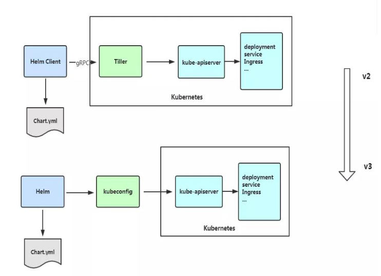
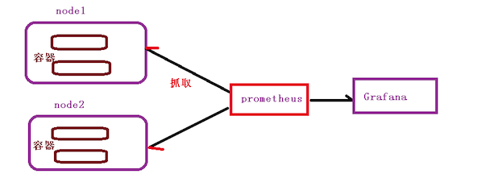
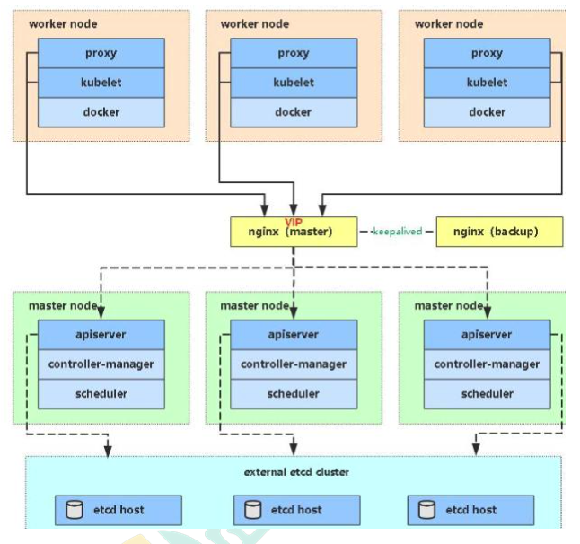

## Kubernate


## 1. 概述

### 1.1 总览

Kubernetes 是 Google 开源的一个容器编排引擎，它支持自动化部署、大规模可伸缩、 应用容器化管理

Kubernate提供容器化应用部署，规划，更新，维护的一种 机制。

Kubernate利于扩展，且简单并且高效


### 1.2 功能

#### 自动装箱

基于容器对应用运行环境的资源配置要求自动部署应用容器

#### 自我修复

+ 当容器失败时，会对容器进行重启, 
+ 当所部署的 Node 节点有问题时，会对容器进行重新部署和重新调度
+ 当容器未通过监控检查时，会关闭此容器直到容器正常运行时，才会对外提供服务

#### 水平扩展

通过简单的命令、用户 UI 界面或基于 CPU 等资源使用情况，对应用容器进行规模扩大 或规模剪裁

#### 服务发现

用户不需使用额外的服务发现机制，就能够基于 Kubernetes 自身能力实现服务发现和 负载均衡

#### 滚动更新

可以根据应用的变化，对应用容器运行的应用，进行一次性或批量式更新

#### 版本回退 

可以根据应用部署情况，对应用容器运行的应用，进行历史版本即时回退

#### 密钥和配置管理 

在不需要重新构建镜像的情况下，可以部署和更新密钥和应用配置，类似热部署。

#### 存储编排 

自动实现存储系统挂载及应用，特别对有状态应用实现数据持久化非常重要

存储系统可以来自于本地目录、网络存储(NFS、Gluster、Ceph 等)、公共云存储服务 (8)批处理

提供一次性任务，定时任务;满足批量数据处理和分析的场景


### 1.3 架构


#### Master Node

k8s 集群控制节点，对集群进行调度管理，接受集群外用户去集群操作请求;

Master Node 由 API Server、Scheduler、ClusterState Store(ETCD 数据库)和 Controller MangerServer 所组成

##### API Server

集群管理统一入口，数据由etcd存储

##### Scheduler

节点调度，比如应用1在node2里面启动

##### Controller-manager

资源控制

##### Etcd

集群信息数据存储


#### Worker Node

集群工作节点，运行用户业务应用容器; Worker Node 包含 kubelet、kube proxy 和 ContainerRuntime;

##### kubelet

master在work node中的代理，管理node节点的状态

##### kube-proxy

网络代理


### 1.4 核心概念

#### Pod

最小编排单元， 一组容器的集合， 一个pod共享网络

生命周期的是短暂的


#### Controller

预期pod的副本数量

可以部署无状态应用部署和有状态应用部署

可以执行一次性任务和定时任务


#### Service

定义一组pod的访问规则


## 2. 安装

单master节点：一个master， 多个node

master集群：多个master，多个node，master和node中间有负载均衡

[kubeadm安装](./使用kubeadm快速部署一个K8s集群.md)

[二进制安装](./使用kubeadm搭建高可用的K8s集群.md)


## 3. Kubectl

### 3.1 概述

kubectl 是 Kubernetes 集群的命令行工具，通过 kubectl 能够对集群本身进行管理，并能 够在集群上进行容器化应用的安装部署。


### 3.2 语法

```shell
kubectl [command] [type] [name] [flag]
```

+ comand:指定要对资源执行的操作，例如 create、get、describe 和 delete
+ TYPE:指定资源类型，资源类型是大小写敏感的，开发者能够以单数、复数和缩略的 形式。例如:
+ NAME:指定资源的名称，名称也大小写敏感的。如果省略名称，则会显示所有的资源， 例如
+ flags:指定可选的参数。例如，可用-s 或者–server 参数指定 Kubernetes API server 的地址和端口。

```shell
[root@k8s-master ~]# kubectl get nodes
NAME         STATUS   ROLES    AGE   VERSION
k8s-master   Ready    master   78d   v1.18.5
k8s-node1    Ready    <none>   78d   v1.18.5
k8s-node2    Ready    <none>   78d   v1.18.5
[root@k8s-master ~]# kubectl get node k8s-node1
NAME        STATUS   ROLES    AGE   VERSION
k8s-node1   Ready    <none>   78d   v1.18.5
[root@k8s-master ~]# kubectl get pods
NAME                    READY   STATUS             RESTARTS   AGE
nginx-f89759699-qdp94   1/1     Running            1          22d
test-liveness-exec      0/1     CrashLoopBackOff   80         73d
[root@k8s-master ~]# kubectl get pod nginx-f89759699-qdp94
NAME                    READY   STATUS    RESTARTS   AGE
nginx-f89759699-qdp94   1/1     Running   1          22d
[root@k8s-master ~]# kubectl --help
kubectl controls the Kubernetes cluster manager.

 Find more information at: https://kubernetes.io/docs/reference/kubectl/overview/

Basic Commands (Beginner):
  create        Create a resource from a file or from stdin.
  expose        Take a replication controller, service, deployment or pod and expose it as a new Kubernetes Service
  run           Run a particular image on the cluster
  set           Set specific features on objects

Basic Commands (Intermediate):
  explain       Documentation of resources
  get           Display one or many resources
  edit          Edit a resource on the server
  delete        Delete resources by filenames, stdin, resources and names, or by resources and label selector

Deploy Commands:
  rollout       Manage the rollout of a resource
  scale         Set a new size for a Deployment, ReplicaSet or Replication Controller
  autoscale     Auto-scale a Deployment, ReplicaSet, or ReplicationController

Cluster Management Commands:
  certificate   Modify certificate resources.
  cluster-info  Display cluster info
  top           Display Resource (CPU/Memory/Storage) usage.
  cordon        Mark node as unschedulable
  uncordon      Mark node as schedulable
  drain         Drain node in preparation for maintenance
  taint         Update the taints on one or more nodes

Troubleshooting and Debugging Commands:
  describe      Show details of a specific resource or group of resources
  logs          Print the logs for a container in a pod
  attach        Attach to a running container
  exec          Execute a command in a container
  port-forward  Forward one or more local ports to a pod
  proxy         Run a proxy to the Kubernetes API server
  cp            Copy files and directories to and from containers.
  auth          Inspect authorization

Advanced Commands:
  diff          Diff live version against would-be applied version
  apply         Apply a configuration to a resource by filename or stdin
  patch         Update field(s) of a resource using strategic merge patch
  replace       Replace a resource by filename or stdin
  wait          Experimental: Wait for a specific condition on one or many resources.
  convert       Convert config files between different API versions
  kustomize     Build a kustomization target from a directory or a remote url.

Settings Commands:
  label         Update the labels on a resource
  annotate      Update the annotations on a resource
  completion    Output shell completion code for the specified shell (bash or zsh)
```


## 4. 资源清单

k8s 集群中对资源管理和资源对象编排部署都可以通过声明样式(YAML)文件来把需要对资源对象操作编辑到 YAML 格式文件中，这种文件叫做资源清单文件, 包括如下对象

+ 控制器
+ 控制器控制的对象


### 4.1 格式

+ 使用空格做为缩进
+ 缩进的空格数目不重要，只要相同层级的元素左侧对齐即可
+ 低版本缩进时不允许使用 Tab 键，只允许使用空格
+ 使用#标识注释，从这个字符一直到行尾，都会被解释器忽略


### 4.2 生成yaml文件

kubectl create 创建yaml文件

```shell
kubectl create deployment web --image=nginx -o yaml --dry-run=client > my1.yaml
```


Kubectl get 导出yaml文件

```shell
kubectl get deploy nginx -o=yaml --export > my2.yaml
```


## 5. Pod

Pod 是 k8s 系统中可以创建和管理的最小单元，是资源对象模型中由用户创建或部署的最 小资源对象模型。**Pod是由一个或多个 container 组成**。

每个Pod中的容器共享网络命名空间

每个 Pod 都有一个特殊的被称为**”根容器“的 Pause 容器**。Pause 容器对应的镜像属于 Kubernetes 平台的一部分，除了 Pause 容器，每个 Pod 还包含一个或多个紧密相关的用户业务容器


### 5.1 特点

#### 资源共享

一个 Pod 里的多个容器可以共享存储和网络，可以看作一个逻辑的主机。共享的如 namespace, cgroups 或者其他的隔离资源。**一个 Pod 内的多个容器之间可以通过 localhost 来进行通信。**一个 Pod 里的**多个容器可以共享存储卷**，这个存储卷会被定义为 Pod 的一部分，并且可 以挂载到该 Pod 里的所有容器的文件系统上。

##### 共享网络

+ 创建根容器
+ 创建业务容器
+ 把业务容器加入根容器

##### 共享存储

+ 数据卷持久化数据


#### 生命周期短暂

Pod 属于生命周期比较短暂的组件，比如，当 Pod 所在节点发生故障，那么该节点上的 Pod 会被调度到其他节点，被重新调度的 Pod 是一个全新的 Pod,跟之前的 Pod 没有关系。


#### 平坦的网络

K8s 集群中的所有 Pod 都在同一个共享网络地址空间中，也就是说每个 Pod 都可以通过其 他 Pod 的 IP 地址来实现访问。


### 5.2 镜像拉取

+ IfNotPresent: 不存在才拉取
+ Always
+ Never


### 5.3 资源限制

通过request和limit， docker对资源进行限制

```yaml
spec:
	containers:
		resource:
			requests:
				memory: "64mi"
				cpu: "250m"
			limits:
				memory: "128mi"
				cpu: "500m"
```


### 5.4 重启机制

+ Always：默认策略
+ onFailure: 当容器退出状态码非0时，才开重启容器
+ Never

```yaml
spec:
	restartPolicy: Never
```


### 5.5 健康检查

#### LivenessProbe

用于判断容器是否存活，即 Pod 是否为 running 状态，如果 LivenessProbe 探针探测到容 器不健康，则 kubelet 将 kill 掉容器，并根据容器的重启策略是否重启。

```yaml
spec
	containers:
	- name: liveness
		livenessProbe:
			exec:
				command:
				- cat
				- /tmp/healthy
			initialDelaySecond: 5
			periodSecond: 5
```


#### ReadinessProbe

用于判断容器是否启动完成，即容器的 Ready 是否为 True，可以接收请求，如果 ReadinessProbe 探测失败，则容器的 Ready 将为 False，控制器将此 Pod 的 Endpoint 从对 应的 service 的 Endpoint 列表中移除

+ httpGet
+ exec
+ topSocket


### 5.6 调度策略

#### 创建pod

+ **master**: api server 把信息存储到etcd
+ **master**: scheduler 通过 api-server 把pod调度到某个节点
+ **node**: kubelet 读取 api-server读取节点的pod信息，docker创建容器


#### 调度因素

##### 资源限制

##### 节点选择器

根据标签进行选择

```shell
#为节点打上标签
kubectl label node k8s-node2  env_role=prod

#查看节点标签
[root@k8s-master ~]# kubectl get nodes --show-labels
NAME         STATUS   ROLES    AGE   VERSION   LABELS
k8s-master   Ready    master   78d   v1.18.5   beta.kubernetes.io/arch=amd64,beta.kubernetes.io/os=linux,kubernetes.io/arch=amd64,kubernetes.io/hostname=k8s-master,kubernetes.io/os=linux,node-role.kubernetes.io/master=
k8s-node1    Ready    <none>   78d   v1.18.5   beta.kubernetes.io/arch=amd64,beta.kubernetes.io/os=linux,kubernetes.io/arch=amd64,kubernetes.io/hostname=k8s-node1,kubernetes.io/os=linux
k8s-node2    Ready    <none>   78d   v1.18.5   beta.kubernetes.io/arch=amd64,beta.kubernetes.io/os=linux,env_role=prod,kubernetes.io/arch=amd64,kubernetes.io/hostname=k8s-node2,kubernetes.io/os=linux
```

```yaml
spec:
	nodeSelector:
		env_role: dev
```

##### 节点亲和性

```yaml
spec:
	affinity:
		nodeAffinity:
			# 硬亲和性，必须满足
			requiredDuringSchedulingIgnoreDuringExecution:
				nodeSelectorTerms:
				- matchExpressions:
					-key: env_role
						operator: In
						values:
						- dev
						- test
			# 软亲和性，尝试满足不保证			
			preferredDuringSchedulingIgnoreDuringExecution:
			- weight: 1
				preference:
					matchExpressions:
					- key: group
						operator: In
						values:
						- otherprod
```

##### 污点

Taint污点：不做普通分配调度，是节点属性，针对特点场景分配

+ NoSchedule: 一定不被调度
+ PreferNoSchedule：尽量不被调度
+ NoExecute: 不会调度，而且会取出node已有pod

```shell
# 查看污点
[root@k8s-master ~]# kubectl describe node k8s-master | grep Taint
Taints:             node-role.kubernetes.io/master:NoSchedule

# 添加污点
[root@k8s-master ~]# kubectl taint node k8s-node1 env_role=yes:NoSchedule
node/k8s-node1 tainted

[root@k8s-master ~]# kubectl create deployment web --image=ngnix

# 清除污点
[root@k8s-master ~]# kubectl taint node k8s-node1 env_role:NoSchedule-
node/k8s-node1 untainted
```

##### 污点容忍

```YAML
tolerations: 
- key:"key1"
	operator:"Equal"#判断条件为 Equal 
	value:"value1" 
	effect:"NoExecute" 
	tolerationSeconds:3600
```


## 6. Controller

在集群上管理容器对象，通过selector和labe建立关系

### 6.1 Deployment

#### 创建

部署无状态应用，管理pod和replicaSet， 可以部署和滚动更新

```shell
# 导出yaml文件
kubectl create deployment web --image=nginx --dry-run -o yaml > web.yaml
```

```YAML
apiVersion: apps/v1
kind: Deployment
metadata:
  creationTimestamp: null
  labels:
    app: web
  name: web
spec:
  replicas: 1
  # Selector label
  selector:
    matchLabels:
      app: web
  strategy: {}
  template:
    metadata:
      creationTimestamp: null
      # container label
      labels:
        app: web
    spec:
      containers:
      - image: nginx
        name: nginx
        resources: {}
```

```shell
# 通过yaml文件创建 deployment
kubectl apply -f web.yaml
```

#### 发布

```shell
[root@k8s-master ~]# kubectl expose deployment web --port=80 --type=NodePort --target-port=80 --name=web -o yaml > web1.yaml
[root@k8s-master ~]# kubectl apply -f web1.yaml
```

#### 升级回滚

```SHELL
[root@k8s-master ~]# kubectl set image deployment web nginx=nginx:1.15

# 查看升级状态
[root@k8s-master ~]# kubectl rollout status deployment web
Waiting for deployment "web" rollout to finish: 1 old replicas are pending termination..

# 查看历史
[root@k8s-master ~]# kubectl rollout history  deployment web

# 回滚到上一个版本
[root@k8s-master ~]# kubectl rollout undo  deployment web
[root@k8s-master ~]# kubectl rollout undo  deployment web --to-revision=3
```

#### 弹性升缩

```SHELL
[root@k8s-master ~]# kubectl scale deployment web --replicas=4
```


### 6.2 Stateful set

每个Pod是独立的，要保持Pod的启动顺序和唯一性

+ 唯一网络表示 ClusterIP 是 none，持久存储
+ 有序, 主从复制

#### 配置

```YAML
apiVersion: v1
kind: Service
metadata
  name: nginx
  labels:
    app: nginx
spec:
  ports:
  - port: 80
    name: web
  clusterIP: None
  selector:
    app: nginx

---

apiVersion: apps/v1
kind: StatefulSet
metadata:
  name: nginx-statefulset
  namespace: default
spec:
  serviceName: nginx
  replicas: 3
  selector:
    matchLabels:
      app: nginx
  template:
    metadata:
      labels:
        app: nginx
    spec:
      containers:
      - name: nginx
        image: nginx:latest
        ports:
        - containerPort: 80
```

```SHELL
[root@k8s-master ~]# kubectl apply -f sts.yaml
service/nginx unchanged
statefulset.apps/nginx-statefulset created
[root@k8s-master ~]# kubectl get svc
NAME         TYPE        CLUSTER-IP       EXTERNAL-IP   PORT(S)        AGE
kubernetes   ClusterIP   10.96.0.1        <none>        443/TCP        85d
nginx        ClusterIP   None             <none>        80/TCP         7m45s
web          NodePort    10.104.113.128   <none>        80:30841/TCP   6d1h
[root@k8s-master ~]# kubectl get pods -o wide
NAME                  READY   STATUS    RESTARTS   AGE   IP            NODE        NOMINATED NODE   READINESS GATES
nginx-statefulset-0   1/1     Running   0          14m   10.244.1.26   k8s-node1   <none>           <none>
nginx-statefulset-1   1/1     Running   0          11m   10.244.2.27   k8s-node2   <none>           <none>
nginx-statefulset-2   1/1     Running   0          11m   10.244.2.28   k8s-node2   <none>           <none>
```


#### 域名规则

主机名 + 安装一定规则生成域名

主机名.service名称.名称空间.svc.cluster.local， eg. **nginx-statefulset-0**.nginx.default.svc.cluster.local, nginx-statefulset-0 是 主机名


### 6.3 Daemon Set

守护进程，在每个node上运行一个pod

#### 配置

```
apiVersion: apps/v1
kind: DaemonSet
metadata:
  name: ds-test 
  labels:
    app: filebeat
spec:
  selector:
    matchLabels:
      app: filebeat
  template:
    metadata:
      labels:
        app: filebeat
    spec:
      containers:
      - name: logs
        image: nginx
        ports:
        - containerPort: 80
        volumeMounts:
        - name: varlog
          mountPath: /tmp/log
      volumes:
      - name: varlog
        hostPath:
          path: /var/log
```

#### 验证

```shell
[root@k8s-master ~]# kubectl apply -f ds.yaml
daemonset.apps/ds-test created
[root@k8s-master ~]# kubectl get daemonset
NAME      DESIRED   CURRENT   READY   UP-TO-DATE   AVAILABLE   NODE SELECTOR   AGE
ds-test   2         2         2       2            2           <none>          7m24s
[root@k8s-master ~]# kubectl get deploy
No resources found in default namespace.
[root@k8s-master ~]# kubectl get pods
NAME            READY   STATUS    RESTARTS   AGE
ds-test-d7pfb   1/1     Running   0          7m34s
ds-test-h2ckx   1/1     Running   0          7m34s
[root@k8s-master ~]# kubectl get pods
NAME            READY   STATUS    RESTARTS   AGE
ds-test-d7pfb   1/1     Running   0          7m37s
ds-test-h2ckx   1/1     Running   0          7m37s
[root@k8s-master ~]# kubectl exec -it ds-test-d7pfb bash
kubectl exec [POD] [COMMAND] is DEPRECATED and will be removed in a future version. Use kubectl kubectl exec [POD] -- [COMMAND] instead.
root@ds-test-d7pfb:/# cd /var/
root@ds-test-d7pfb:/var# ls -rlt
total 0
```


### 6.3 Job & CronJob

#### 配置

Job 运行一次，运行完以后状态更新为completed

```yaml
apiVersion: batch/v1
kind: Job
metadata:
  name: pi
spec:
  template:
    spec:
      containers:
      - name: pi
        image: perl
        command: ["perl",  "-Mbignum=bpi", "-wle", "print bpi(2000)"]
      restartPolicy: Never
  backoffLimit: 4
```

CronJob 是定期执行

```yaml
apiVersion: batch/v1beta1
kind: CronJob
metadata:
  name: hello
spec:
  schedule: "*/1 * * * *"
  jobTemplate:
    spec:
      template:
        spec:
          containers:
          - name: hello
            image: busybox
            args:
            - /bin/sh
            - -c
            - date; echo Hello from the Kubernetes cluster
          restartPolicy: OnFailure
```


#### 验证

```SHELL
[root@k8s-master ~]# kubectl logs pi-dbrkq
3.1415926535897932384626433832795028841971693993751058209749445923078164062862089986280348253421170679821480865132823066470938446095505822317253594081284811174502841027019385211055596446229489549303819644288109756659334461284756482337867831652712019091456485669234603486104543266482133936072602491412737245870066063155881748815209209628292540917153643678925903600113305305488204665213841469519415116094330572703657595919530921861173819326117931051185480744623799627495673518857527248912279381830119491298336733624406566430860213949463952247371907021798609437027705392171762931767523846748184676694051320005681271452635608277857713427577896091736371787214684409012249534301465495853710507922796892589235420199561121290219608640344181598136297747713099605187072113499999983729780499510597317328160963185950244594553469083026425223082533446850352619311881710100031378387528865875332083814206171776691473035982534904287554687311595628638823537875937519577818577805321712268066130019278766111959092164201989380952572010654858632788659361533818279682303019520353018529689957736225994138912497217752834791315155748572424541506959508295331168617278558890750983817546374649393192550604009277016711390098488240128583616035637076601047101819429555961989467678374494482553797747268471040475346462080466842590694912933136770289891521047521620569660240580381501935112533824300355876402474964732639141992726042699227967823547816360093417216412199245863150302861829745557067498385054945885869269956909272107975093029553211653449872027559602364806654991198818347977535663698074265425278625518184175746728909777727938000816470600161452491921732172147723501414419735685481613611573525521334757418494684385233239073941433345477624168625189835694855620992192221842725502542568876717904946016534668049886272327917860857843838279679766814541009538837863609506800642251252051173929848960841284886269456042419652850222106611863067442786220391949450471237137869609563643719172874677646575739624138908658326459958133904780275901

[root@k8s-master ~]# kubectl logs hello-1601181300-5d66z
Sun Sep 27 04:34:45 UTC 2020
Hello from the Kubernetes cluster
```


## 7. Service

通过创建 Service,可以为一组具有相同功能的容器应 用提供一个统一的入口地址，并且将请求负载分发到后端的各个容器应用上

Service 通过虚拟IP， selector 和 label建立关系

+ 服务发现，防止ip访问无效
+ 负载均衡


### 类型

ClusterIP: 集群内部使用， clusterIP是none就是 headless service， 网络唯一标识符

NodePort: 对外使用

LoadBalancer：公有云使用


### 配置

```SHELL
[root@k8s-master ~]# kubectl expose deployment web --dry-run --port=80 --target-port=80 -o yaml > service.yaml
W0920 21:12:53.101315   11506 helpers.go:535] --dry-run is deprecated and can be replaced with --dry-run=client.
```

```yaml
apiVersion: v1
kind: Service
metadata:
  creationTimestamp: null
  labels:
    app: web
  name: web
spec:
  ports:
  - port: 80
    protocol: TCP
    targetPort: 80
  selector:
    app: web
  # 默认是 type: ClusterIP
status:
  loadBalancer: {}
```


## 8. Secret

Secret 解决了密码、token、密钥等敏感数据的配置问题，而不需要把这些敏感数据暴露 到镜像或者 Pod Spec 中。Secret 可以以 Volume 或者环境变量的方式使用

### 配置

```YAML
apiVersion: v1
kind: Secret
metadata:
  name: mysecret
type: Opaque
data:
  username: YWRtaW4=
  password: MWYyZDFlMmU2N2Rm
```

### 挂载

+ 以变量挂载
+ 以volume挂载

```YAML
# 变量形式挂载
apiVersion: v1
kind: Pod
metadata:
  name: mypod
spec:
  containers:
  - name: nginx
    image: nginx
    env:
      - name: SECRET_USERNAME
        valueFrom:
          secretKeyRef:
            name: mysecret
            key: username
      - name: SECRET_PASSWORD
        valueFrom:
          secretKeyRef:
            name: mysecret
            key: password
```

```shell
[root@k8s-master ~]# kubectl exec -it mypod bash
kubectl exec [POD] [COMMAND] is DEPRECATED and will be removed in a future version. Use kubectl kubectl exec [POD] -- [COMMAND] instead.
root@mypod:/# kubectl get pods
bash: kubectl: command not found
root@mypod:/# echo $SECRET_USERNAME
admin
root@mypod:/# echo $SECRET_PASSWORD
1f2d1e2e67df
```

```YAML
# VOLUME形式挂载
apiVersion: v1
kind: Pod
metadata:
  name: mypod
spec:
  containers:
  - name: nginx
    image: nginx
    volumeMounts:
    - name: foo
      mountPath: "/etc/foo"
      readOnly: true
  volumes:
  - name: foo
    secret:
      secretName: mysecret
```

```SHELL
[root@k8s-master ~]# kubectl create -f secret-vol.yaml
pod/mypod created
[root@k8s-master ~]# kubectl exec -it mypod bash
kubectl exec [POD] [COMMAND] is DEPRECATED and will be removed in a future version. Use kubectl kubectl exec [POD] -- [COMMAND] instead.
root@mypod:/# ls /etc/foo/
password  username
root@mypod:/# cd /etc/foo/
root@mypod:/etc/foo# cat password
1f2d1e2e67dfroot@mypod:/etc/foo#
root@mypod:/etc/foo# cat username
adminroot@mypod:/etc/foo#
root@mypod:/etc/foo#
```


## 9. ConfigMap

ConfigMap 功能在 Kubernetes1.2 版本中引入，许多应用程序会从配置文件, 命令行参数 或环境变量中读取配 置信息

### Volume 挂载

```shell
[root@k8s-master configmap]# kubectl  create configmap redis-config --from-file=redis.properties
configmap/redis-config created
[root@k8s-master configmap]# kubectl describe cm redis-config
Name:         redis-config
Namespace:    default
Labels:       <none>
Annotations:  <none>

Data
====
redis.properties:
----
redis.host=127.0.0.1
redis.port=6379
redis.password=123456

Events:  <none>
```

```YAML
# VOLUME 挂载
apiVersion: v1
kind: Pod
metadata:
  name: mypod
spec:
  containers:
    - name: busybox
      image: busybox
      command: [ "/bin/sh","-c","cat /etc/config/redis.properties" ]
      volumeMounts:
      - name: config-volume
        mountPath: /etc/config
  volumes:
    - name: config-volume
      configMap:
        name: redis-config
  restartPolicy: Never
```

### 变量挂载

```YAML
apiVersion: v1
kind: ConfigMap
metadata:
  name: myconfig
  namespace: default
data:
  special.level: info
  special.type: hello
```

```YAML
apiVersion: v1
kind: Pod
metadata:
  name: mypod
spec:
  containers:
    - name: busybox
      image: busybox
      command: [ "/bin/sh", "-c", "echo $(LEVEL) $(TYPE)" ]
      env:
        - name: LEVEL
          valueFrom:
            configMapKeyRef:
              name: myconfig
              key: special.level
        - name: TYPE
          valueFrom:
            configMapKeyRef:
              name: myconfig
              key: special.type
  restartPolicy: Never
```


## 10. 集群安全机制

### 安全三步骤

**认证**

+ 对外暴露端口是6443
+ 认证方式： https证书认证，http token认证，用户名 + 密码

**授权**：基于RBAC进行授权

**准入控制**：如果列表中有请求资源，则请求；否则拒绝

访问过程都需要经过api server， api server 统一协调管理，访问过程中需要证书，token或者用户名/密码


### RBAC 基于角色的访问控制

角色：

+ role: 特定命名空间权限
+  clusterRole：所有命名空间权限

主体：user，group， service account

进行绑定

+ roleBinding：角色绑定到主体
+ clusterRoleBinding：集权角色绑定到主体


### 配置

创建角色

```YAML
kind: Role
apiVersion: rbac.authorization.k8s.io/v1
metadata:
  namespace: roledemo
  name: pod-reader
rules:
- apiGroups: [""] # "" indicates the core API group
  resources: ["pods"]
  verbs: ["get", "watch", "list"]
```

查看角色

```SHELL
[root@k8s-master rbac]# kubectl apply -f rbac-role.yaml
role.rbac.authorization.k8s.io/pod-reader created
[root@k8s-master rbac]# kubectl get role
No resources found in default namespace.
[root@k8s-master rbac]# kubectl get role -n roledemo
NAME         CREATED AT
pod-reader   2020-09-27T10:32:17Z
[root@k8s-master rbac]# kubectl apply -f rbac-rolebinding.yaml
rolebinding.rbac.authorization.k8s.io/read-pods created
```


## 11. Ingress

Service 的 NodePort可以对外暴露端口，在每个节点上面都会启动端口，在访问的时候，可以通过任何节点 + 端口实现访问

ingress是统一入口，通过域名，关联一个service， service关联一组pod进行访问

### 安装

```SHELL
[root@k8s-master rbac]# kubectl create deployment web --image=nginx
deployment.apps/web created
[root@k8s-master rbac]# kubectl get pods
NAME                   READY   STATUS              RESTARTS   AGE
mypod                  0/1     Completed           0          66m
web-5dcb957ccc-frgfl   0/1     ContainerCreating   0          6s
[root@k8s-master rbac]# kubectl expose deployment web --port=90 --target-port=80 --type=NodePort
service/web exposed
[root@k8s-master rbac]# kubectl get svc
NAME         TYPE        CLUSTER-IP      EXTERNAL-IP   PORT(S)        AGE
kubernetes   ClusterIP   10.96.0.1       <none>        443/TCP        85d
web          NodePort    10.96.219.156   <none>        90:30675/TCP   6s
[root@k8s-master ingress]# kubectl apply -f ingress-controller.yaml
namespace/ingress-nginx created
configmap/nginx-configuration created
configmap/tcp-services created
configmap/udp-services created
serviceaccount/nginx-ingress-serviceaccount created
clusterrole.rbac.authorization.k8s.io/nginx-ingress-clusterrole created
role.rbac.authorization.k8s.io/nginx-ingress-role created
rolebinding.rbac.authorization.k8s.io/nginx-ingress-role-nisa-binding created
clusterrolebinding.rbac.authorization.k8s.io/nginx-ingress-clusterrole-nisa-binding created
deployment.apps/nginx-ingress-controller created
limitrange/ingress-nginx created
[root@k8s-master ingress]# view ingress-controller.yaml
[root@k8s-master ingress]# kubectl get pods -n ingress-nginx
NAME                                       READY   STATUS              RESTARTS   AGE
nginx-ingress-controller-766fb9f77-vsv46   0/1     ContainerCreating   0          67s
[root@k8s-master ingress]# kubectl get pods -n ingress-nginx -o wide
NAME                                       READY   STATUS    RESTARTS   AGE     IP              NODE        NOMINATED NODE   READINESS GATES
```

### 配置

```YAML
apiVersion: networking.k8s.io/v1beta1
kind: Ingress
metadata:
  name: example-ingress
spec:
  rules:
  - host: example.ingredemo.com
    http:
      paths:
      - path: /
        backend:
          serviceName: web
          servicePort: 80
```

配置host文件

```properties
192.168.66.50 example.ingredemo.com
```


## 12. Helm

K8S 上的应用对象，都是由特定的资源描述组成，包括 deployment、service 等。都保存 各自文件中或者集中写到一个配置文件。然后 kubectl apply –f 部署。如果应用只由一 个或几个这样的服务组成，上面部署方式足够了。而对于一个复杂的应用，会有很多类似 上面的资源描述文件，例如微服务架构应用，组成应用的服务可能多达几十个。如果有更新或回滚应用的需求，可能要修改和维护所涉及的大量资源文件，而这种组织和管 理应用的方式就显得力不从心了。

**Helm解决如下问题**

+ 将服务作为一个整体管理 
+ 资源文件高效复用
+ 支持应用级别的版本管理

### 概念

Helm 是一个Kubernetes的包管理工具，就像 Linux 下的包管理器，如 yum/apt 等，可以方便的将之前打包好的 yaml 文件部署到 kubernetes 上。

**Helm**: 一个命令行客户端工具，主要用于 Kubernetes 应用 chart 的创建、打包、发 布和管理。

**Chart**: 应用描述，一系列用于描述 k8s 资源相关文件的集合。

**Release**: 基于 Chart 的部署实体，一个 chart 被 Helm 运行后将会生成对应的一个 release;将在 k8s 中创建出真实运行的资源对象。


### 架构



+  Tiller 的删除
+ Release 名称可以在不同命名空间重用
+ 支持将 Chart 推送至 Docker 镜像仓库中
+ 使用 JSONSchema 验证 chart values


### 安装

```SHELL
[root@k8s-master ~]# tar xvf helm-v3.3.4-linux-amd64.tar.gz
linux-amd64/
linux-amd64/README.md
linux-amd64/LICENSE
linux-amd64/helm
[root@k8s-master ~]# cd linux-amd64/
[root@k8s-master linux-amd64]# mv helm /usr/bin/
[root@k8s-master linux-amd64]# helm
The Kubernetes package manager

Common actions for Helm:

- helm search:    search for charts
- helm pull:      download a chart to your local directory to view
- helm install:   upload the chart to Kubernetes
- helm list:      list releases of charts

[root@k8s-master linux-amd64]# helm repo add stable http://mirror.azure.cn/kubernetes/charts
"stable" has been added to your repositories
[root@k8s-master linux-amd64]#
[root@k8s-master linux-amd64]# helm repo add aliyun https://kubernetes.oss-cn-hangzhou.aliyuncs.com/charts
"aliyun" has been added to your repositories
[root@k8s-master linux-amd64]# helm repo update
Hang tight while we grab the latest from your chart repositories...
...Successfully got an update from the "aliyun" chart repository
...Successfully got an update from the "stable" chart repository
Update Complete. ⎈Happy Helming!⎈
[root@k8s-master linux-amd64]# helm repo list
NAME  	URL
stable	http://mirror.azure.cn/kubernetes/charts
aliyun	https://kubernetes.oss-cn-hangzhou.aliyuncs.com/charts
```


### 部署

部署以后把 type 改为 NodePort 暴露端口给外界

```SHELL
[root@k8s-master linux-amd64]# helm search repo weave
NAME              	CHART VERSION	APP VERSION	DESCRIPTION
aliyun/weave-cloud	0.1.2        	           	Weave Cloud is a add-on to Kubernetes which pro...
aliyun/weave-scope	0.9.2        	1.6.5      	A Helm chart for the Weave Scope cluster visual...
stable/weave-cloud	0.3.7        	1.4.0      	Weave Cloud is a add-on to Kubernetes which pro...
stable/weave-scope	1.1.10       	1.12.0     	A Helm chart for the Weave Scope cluster visual...
[root@k8s-master linux-amd64]# helm install ui stable/weave-scope
NAME: ui
LAST DEPLOYED: Mon Sep 28 11:40:54 2020
NAMESPACE: default
STATUS: deployed
REVISION: 1
NOTES:
You should now be able to access the Scope frontend in your web browser, by
using kubectl port-forward:

kubectl -n default port-forward $(kubectl -n default get endpoints \
ui-weave-scope -o jsonpath='{.subsets[0].addresses[0].targetRef.name}') 8080:4040

then browsing to http://localhost:8080/.
For more details on using Weave Scope, see the Weave Scope documentation:

https://www.weave.works/docs/scope/latest/introducing/
[root@k8s-master linux-amd64]# helm list
NAME	NAMESPACE	REVISION	UPDATED                                	STATUS  	CHART             	APP VERSION
ui  	default  	1       	2020-09-28 11:40:54.133540885 -0400 EDT	deployed	weave-scope-1.1.10	1.12.0
[root@k8s-master linux-amd64]# helm status ui
NAME: ui
LAST DEPLOYED: Mon Sep 28 11:40:54 2020
NAMESPACE: default
STATUS: deployed
REVISION: 1
NOTES:
You should now be able to access the Scope frontend in your web browser, by
using kubectl port-forward:

kubectl -n default port-forward $(kubectl -n default get endpoints \
ui-weave-scope -o jsonpath='{.subsets[0].addresses[0].targetRef.name}') 8080:4040

then browsing to http://localhost:8080/.
For more details on using Weave Scope, see the Weave Scope documentation:

https://www.weave.works/docs/scope/latest/introducing/
[root@k8s-master linux-amd64]# kubectl edit svc ui-weave-scope
service/ui-weave-scope edited
[root@k8s-master linux-amd64]# kubectl get svc
NAME             TYPE        CLUSTER-IP       EXTERNAL-IP   PORT(S)        AGE
kubernetes       ClusterIP   10.96.0.1        <none>        443/TCP        87d
ui-weave-scope   NodePort    10.103.143.172   <none>        80:30845/TCP   5m37s
web              NodePort    10.108.181.13    <none>        80:32480/TCP   14h
```


### 自定义Chart

+ Chart.yaml： 当前chart的配置信息
+ templates： 编写yaml文件的目录, 包括deployment， service， ingress
+ values.yaml： yaml文件中的全局变量

```shell
[root@k8s-master ~]# helm create mychart
Creating mychart
[root@k8s-master ~]# ls
anaconda-ks.cfg                 jdk-8u261-linux-x64.rpm  nacos                            secret-vol.yaml          test1
configmap                       job.yaml                 nacos-server-1.4.0-SNAPSHOT.zip  secret.yaml              test2
cronjob.yaml                    linux-amd64              nginx-deployment.yaml            secrete.yaml             web.yaml
ds.yaml                         my1.yaml                 nginx.yaml                       service.yaml             web1.yaml
helm-v3.3.4-linux-amd64.tar.gz  my2.yaml                 rbac                             sts.yaml
ingress                         mychart                  secret-var.yaml                  test-liveness-exec.yaml
[root@k8s-master ~]# cd mychart/
[root@k8s-master mychart]# ls -rlt
total 8
-rw-r--r--. 1 root root 1800 Sep 29 01:40 values.yaml
drwxr-xr-x. 3 root root  162 Sep 29 01:40 templates
-rw-r--r--. 1 root root 1098 Sep 29 01:40 Chart.yaml
drwxr-xr-x. 2 root root    6 Sep 29 01:40 charts
[root@k8s-master mychart]# view Chart.yaml
[root@k8s-master mychart]# cd ..
[root@k8s-master ~]# cd mychart/
[root@k8s-master mychart]# cd templates/
[root@k8s-master templates]# kubectl create deployment web1 --image=nginx --dry-run  -o yaml > deployment.yaml
W0929 01:46:16.069642    9013 helpers.go:535] --dry-run is deprecated and can be replaced with --dry-run=client.
[root@k8s-master templates]# kubectl expose deployment web1 --port=80 --target-port=80 --type=NodePort --dry-run=client  -o yaml > service.yaml
[root@k8s-master templates]#
[root@k8s-master ~]# helm install web1 mychart/
NAME: web1
LAST DEPLOYED: Tue Sep 29 01:51:36 2020
NAMESPACE: default
STATUS: deployed
REVISION: 1
NOTES:
1. Get the application URL by running these commands:
  export POD_NAME=$(kubectl get pods --namespace default -l "app.kubernetes.io/name=mychart,app.kubernetes.io/instance=web1" -o jsonpath="{.items[0].metadata.name}")
  echo "Visit http://127.0.0.1:8080 to use your application"
  kubectl --namespace default port-forward $POD_NAME 8080:80
[root@k8s-master ~]# helm upgrade web1 mychart/  
```


### Chart模板

通过传递参数，动态渲染模板，yaml内容动态传入参数

+ 在values.yaml定义变量和值, 
+ 在其他yaml文件中获取值, e.g. image, tag, label, port, replicas
  + **{{ .Values.[var]}}** 替代values中定义的变量
  + **{{ .Release.Name}}** 定义版本信息

values.yaml

```properties
replicas: 1
image: nginx
tag: 1.16
label: nginx
port: 80
```

Deployment.yaml

```YAML
kind: Deployment
metadata:
  name: {{ .Release.Name}}-deploy
spec:
  replicas: 1
  selector:
    matchLabels:
      app: {{ .Values.label}}
  strategy: {}
  template:
    metadata:
      creationTimestamp: null
      labels:
        app: {{ .Values.label}}
    spec:
      containers:
      - image: {{ .Values.image}}
        name: nginx
        resources: {}
status: {}
```

Service.yaml

```YAML
apiVersion: v1
kind: Service
metadata:
  name: {{ .Release.Name}}-svc
spec:
  ports:
  - port: {{ .Values.port}}
    protocol: TCP
    targetPort: 80
  selector:
    app: {{ .Values.label}}
  type: NodePort
status:
  loadBalancer: {}
```


## 13. PV & PVC

### Persistent Volume

是集群中由管理员配置的一段网络存储。 **它是集群中的资源，就像节点是集群资源一样**。 PV 是容量插件，如 Volumes，但其生命周期独立于使用 PV 的任 何单个 pod。 此 API 对象捕获存储实现的详细信息，包括 NFS，iSCSI 或特定于云提供程 序的存储系统。

### Persistent Volume Claim

是由用户进行存储的请求。 它类似于 pod。 **Pod 消耗节点 资源，PVC 消耗 PV 资源。**Pod 可以请求特定级别的资源(CPU 和内存)。声明可以请求特 定的大小和访问模式(例如，可以一次读/写或多次只读)。

### 配置

```yaml
apiVersion: v1
kind: PersistentVolume
metadata:
  name: my-pv
spec:
  capacity:
    storage: 5Gi
  accessModes:
    - ReadWriteMany
  nfs:
    path: /k8s/nfs
    server: 192.168.44.134

---

apiVersion: v1
kind: PersistentVolumeClaim
metadata:
  name: my-pvc
spec:
  accessModes:
    - ReadWriteMany
  resources:
    requests:
      storage: 5Gi
      
---

apiVersion: apps/v1
kind: Deployment
metadata:
  name: nginx-dep1
spec:
  replicas: 3
  selector:
    matchLabels:
      app: nginx
  template:
    metadata:
      labels:
        app: nginx
    spec:
      containers:
      - name: nginx
        image: nginx
        volumeMounts:
        - name: wwwroot
          mountPath: /usr/share/nginx/html
        ports:
        - containerPort: 80
      volumes:
      - name: wwwroot
        persistentVolumeClaim:
          claimName: my-pvc
```


## 13. 集群监控

集群监控： 节点资源利用率，节点数， 运行pod

pod监控：容器指标，应用程序

prometheus + grafana 搭建监控平台

+ prometheus：开源方案，集成监控，报警，数据库。以http协议周期型抓取监控组件的状态
+ grafana：开源方案，数据分析和可视化工具， 支持多种数据源


### 架构



### 部署

```shell
[root@k8s-master k8s-prometheus-grafana-master]# kubectl create -f node-exporter.yaml
daemonset.apps/node-exporter created
service/node-exporter created

[root@k8s-master prometheus]# kubectl create -f rbac-setup.yaml
clusterrole.rbac.authorization.k8s.io/prometheus created
serviceaccount/prometheus created
clusterrolebinding.rbac.authorization.k8s.io/prometheus created
[root@k8s-master prometheus]# kubectl create -f configmap.yaml
configmap/prometheus-config created
[root@k8s-master prometheus]# kubectl create -f prometheus.deploy.yml
deployment.apps/prometheus created
[root@k8s-master prometheus]# kubectl create -f prometheus.svc.yml
service/prometheus created
[root@k8s-master prometheus]#

[root@k8s-master grafana]# kubectl create -f grafana-deploy.yaml
deployment.apps/grafana-core created
[root@k8s-master grafana]# vi grafana-svc.yaml
[root@k8s-master grafana]# kubectl create -f grafana-svc.yaml
service/grafana created
[root@k8s-master grafana]# kubectl create -f grafana-ing.yaml
ingress.extensions/grafana created
```


## 14. 高可用k8s

对 Kubernetes 集群，高可用性还应包含以下两个层面的考虑:Etcd 数据库的高可用性 和 Kubernetes Master 组件的高可用性。 而 Etcd 我们已经采用 3 个节点组建集群实现高 可用，本节将对 Master 节点高可用进行说明和实施。

Master 节点主要有三个服务 kube-apiserver、kube-controller-mansger 和 kube- scheduler，其中 kube-controller-mansger 和 kube-scheduler 组件自身通过选择机制已 经实现了高可用，所以 Master 高可用主要针对 kube-apiserver 组件，而该组件是以 HTTP API 提供服务，因此对他高可用与 Web 服务器类似，增加负载均衡器对其负载均衡即可， 并且可水平扩容。

